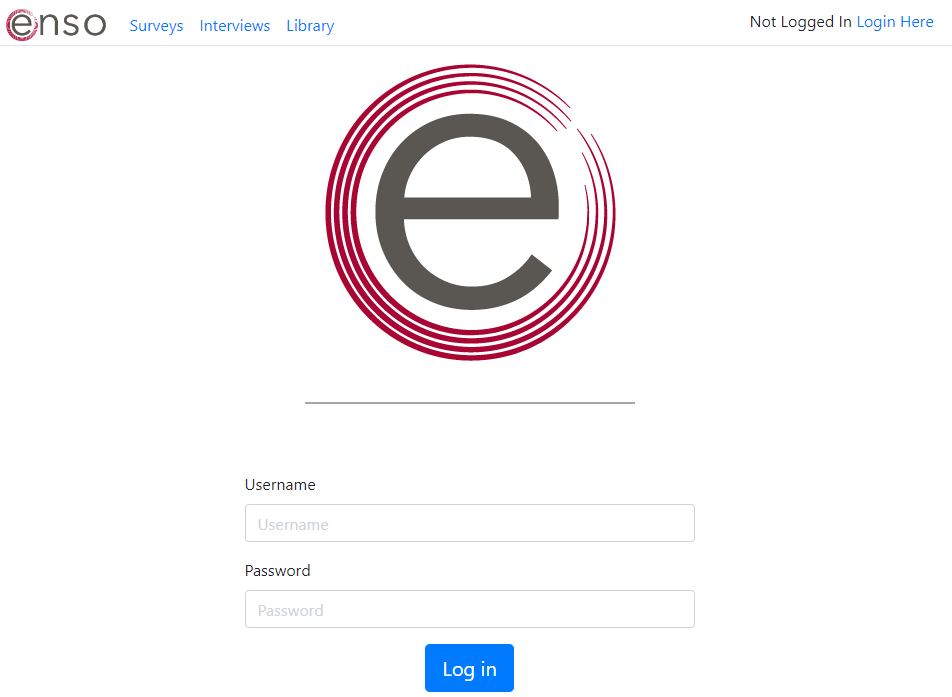

[Managing Interviews Using Enso](_pages/ManagingInterviews.md)

# Enso Survey Building Guide

## Enso Login and home screen

- Login via the Enso gateway. Enter your unique username and password in the boxes, and click “Log in.”
    - If you ever forget what your user and password are, please contact an associate with administrative access to Enso.
        
        
        

### Enso home screen

- Once you are logged in, you should see the screen below, but in the upper right corner it will say “Logged in as *your username*”.
- The user role assigned to your account determines which Enso features you can access and use.
- An Admin user can to create **Projects**, within which you can host multiple **Surveys**. Each user you create can have different roles within and across projects.
    
    
    

## Creating and Editing Surveys

To begin creating a survey (or editing a survey you have already started), click on the **Surveys** button in the middle of the page. Alternatively, you can click Surveys from the menu at the top of the page.

To begin creating a new survey, click the green button **Create New Survey**.

- In the textbox for **Survey Description**, type in a descriptive title for the survey you will create (e.g., “Fun Survey”).
- Next, in the **Project** drop-down box, select which project you want to assign the survey.
- Then click the blue button **Create New Survey**.
    
    
    
    - After clicking the button, you will see the text “Successfully created survey” below the top menu as a confirmation.
        
        
        

### Edit Survey

Survey information fields include:

- Name – Give it a unique name that will be displayed at the top of the screen during interviews as well as in the list of surveys for editing and administration.
- Version ID -- Enso assigns each survey a number, and the version corresponds to which version of the survey this is (*once we have versioning in place)
- Shortcut URL – Create a unique URL to send respondents directly to the survey link on the Enso page where they can begin a survey.
- Project – Lists the project name under which the survey was created.
- These fields can be edited by clicking the button “**Edit Survey Info**”,
    
    
    

Additional information:

- Cannot duplicate surveys yet. (we are working on developing this feature!)
- Cannot export a survey as a PDF, print version, or codebook. We’re working on it!
- For longitudinal surveys, you want to create a new, unique survey for each instance of follow-up. This is important for carrying alters across time points.
- A respondent ID can be linked across surveys. Each interview gets its own unique ID in Enso so respondent IDs can be used multiple times.

Each survey you create in Enso is comprised of **Sections, Pages, and Questions, which are detailed in the sections below.**

<section class="c-alert c-alert--warning">
  <header class="c-alert__header">
    
Helpful Tip

  </header>
  

  <b>Helpful Tip</b>
   
    It is highly recommended that you think through how you want to organize and display your survey questions and create the all desired sections and pages **BEFORE** you start creating the survey questions. This is because you cannot move a question to a different section or page once you have created it within a section and page (although you can reorder pages). This tip will save you from having to delete and re-create survey questions.
  

</section>

#### Sections

Within a survey, you can create new sections to break up the survey and allow for navigation across sections. For example, you might organize your survey questions into distinct sections with labels such as demographics, personal, family/kinship, or work/profession. 

Sections are comprised of:

- Section ID – Enso assigns each section a number. These can be used later to move sections if necessary.
- Title – You can give each section a title that will be displayed at the top of the page when administering a survey. This will also appear at the top of the survey editing page to help you navigate sections while editing.
- Display logic – You can choose logic to display a section, such as only displaying a section given a certain value or response given for a specific variable.
    
    
    

Additional information:

- Can create the entire survey in one section if you’d like.
- Can renumber sections to move them in the survey (theoretically, but sometimes this gets glitchy when you try it).
- Can use display logic to use variables to display or not display a section.
- Can duplicate an entire section. ***If you do this and want to use the same questions but not accidentally save the data value in the same column as the previous time

#### Pages

Within a section, you can create as many pages as you’d like to break up the survey. **Enso saves data when you click “Next page,” so it’s a good idea to break the survey up across pages.** In addition, it can be easier to navigate for the interviewer/respondent. Pages are comprised of:

- Page Number – Tells you the order in which the pages appear.
- Page ID – Enso assigns each page a number. These can be used later to move pages if necessary, and is numbered in the order pages are created, NOT how they appear.
- Next Page ID – This tells you the number of the page that will appear next, and can be used to move pages.
- Display logic – You can choose logic to display a page, such as only displaying a page given a certain value or response given for a specific variable.
    
    
    

Additional information:

- We strongly recommend using a new page for each Name Generator question. This is because Enso saves data when you click “Next page,” and you are adding new names with each generator. If you have the next question on the same page and it USES the list of alters from that name generator, you may not see all of the alters listed for the question. To avoid this possibility, we recommend a new page for each name generator.
- Can move pages around in the survey by choosing the Next Page ID of the page you want the current page to precede. This is not foolproof just yet.*
- Can use display logic to use variables to display or not display a page.
- Can duplicate an entire page. ***If you do this and want to use the same questions but save unique data, you MUST CHANGE VARIABLE NAMES.***

*In summary, if you use the **Duplicate** button for a section, page, or question, PLEASE remember to **change the variable names**!!!*

#### Questions

Each question in Enso has a unique set of parameters to customize. However, they all share the following characteristics:

- **Question ID** – Auto-assigned by Enso
- **Next question ID** - Can be edited to move question
- **Question type** – This tells you what type of question you are asking, from a list of question types that we’ll go into detail about below. Will also tell you if you are using an ego or alter question type (ego question type means it’s just a regular survey question).
- **Variable name(s)** – Each question is automatically assigned a variable number/name. I strongly recommend you change these to variable names that make sense for your data for ease of reading the data in
- **Prompt** – This is where you type the question prompt or static text that you want displayed for the question.
- **“Choices”** – these are essentially the response options, for most questions. Will show more detail below.
- **Alter groups** - determine which alters you want to display/save/exclude from a question
- Other choices based on question type. More detail below.

Other aspects of the question editing screen:

- **Edit question** – click this to edit the question
- **“Save”** – click to save once you’ve made edits
- **“Cancel”** – click to cancel edits or editing mode
- **“Duplicate question”** – duplicates the question if you just want to, for example, change some wording but use same response options.
- **Delete (trash icon) –** deletes the It will double-check with you before deleting permanently!
- **Display logic** – use display logic to choose to display the question based on responses to previous questions.
    
    
    

After creating 1 or more questions on a page, you can preview how the question(s) will be displayed to respondents by clicking the “Preview Page” button located in the middle of the screen.

## Question Types

There are three general categories of questions you can use in Enso:

1. **Ego questions** - essentially standard survey questions, asked of ego or respondent)
2. **Alter questions** - name generators, name choosers/pickers, and standard survey questions but asked of each alter that ego names and/or every alter on roster
3. **Alter-tie questions** – questions that elicit relationships or ties between alters).

Below we’ll go through each category of questions, and details of customization for each question type.

### Question Types and Instructions for Ego Questions

Ego question types include:

1. **Date/Time**
2. **Multiple Choice**
3. **Multiple Choice Grid Row**
4. **Numeric Field**
5. **Paragraph Field**
6. **Text Field**
7. **Static Text (prompt only)**
8. **Range Slider**

#### Date/Time
Captures data in date and time
- Enter variable Defaults to QID_DATE
- Specify whether to **Allow User Input** or use **Timestamp**
- User input: Specify month, date, year, time, or any combination
- Can also save current time in ISO 8601 format
- Can display current date and/or time as default
- Displays boxes corresponding to the selected date/time format Data are saved as:
- All chosen formats above, in individual variable columns

#### Multiple Choice
Standard multiple choice question
- Can set to select one only or allow multiple selections
- Enter question prompt text in the “Prompt”
- Choose whether to display responses horizontally or vertically (default)
- If select only one:
    - Set variable Example “HasDog” for whether the person has a dog or not.
    - Enter response choices text and values in the following format, one per line: “Choice text”:”choice value”, e.g.,
        - “Yes”:”1”
        - “No”:”2”
- If you hit “enter” after the last choice you may end up with an empty choice Be sure to not have the cursor on a new line when saving the question.
- Enso saves the data in a column headed “HasDog” as 1 for Yes and 2 for No.
- If select all that apply:
    - Enter response choices text and set that text plus some portion of the variable name as the value as well, because Enso uses the “value” as a unique variable name for each response option, assigning binary values for selection
    - Example for a question asking if the person has a Enter:
        - “Yes”:”HasDog_Y” and HasDog_Y is variable name
        - “No”:”HasDog_N” and HasDog_N is variable name
        - Each variable column has 0 or 1 for whether it was selected or not.
- “Other” option – you may select **Other** option and present a text box in which respondent can explain the other option.

Data are saved as:

- If single response selection, set name of variable and data are saved as however values were assigned in **Choices** box for response options.
- If set as select multiple, each response option is saved as its own variable, with 0 if not selected and 1 if selected.
- If **Other** option is selected, there is a column for these data (e.g., “HasDog_OTHER” with a 1 if selected, and a second column “HasDog_OTHER_TEXT” for the text response.

Example: Standard multiple choice question below.

Example: Multiple choice in which you allow multiple selections below.

#### Multiple Choice Grid Row
For multiple questions using the same response option, such as a Likert You can include the response options at the top and repeat just the question stems in the rows.

- For the header row, enter the prompt, instructions, or question stem that you want to head up the grid rows.
- Select **Header Row Only** for that
- Enter the response choices that you want across grid
- Copy the grid ID number down. You need this for subsequent questions.

Example of grid row header question:

- Create a new Multiple Choice Header Row question
- Enter the prompt for the
- Enter the SAME response choices that you want across grid
- **Paste the grid ID in the Grid ID box**. This links the question to the header row.
- **Repeat for as many rows as you**
    
    
    

#### Numeric Field
For questions requiring user to enter a numeric reponse.

- Default variable name is QID_NUMBER
- Enter new variable name
- Enter question prompt
- You may put text in the placeholder box that will tell the respondent what to do, e.g., “Please enter your age here.”
- You can choose whether the number is an **integer, float, or decimal.** Data are saved accordingly.
    
    
    

#### Text Field and Paragraph Field
Enter plain text data in short or long
- Format is the same for both text field and paragraph text, but the latter can take more characters (e.g., for a qualitative interview response).
- Enter question prompt
- You may put text in the empty box as a placeholder
- Data are saved as
- Looks the same as the above numeric field

#### Static Text (prompt)
This acts as a static text field for prompts, instructions, and any other time you want to present text but not save data.

- **Prompt:** Enter prompt only, does not save as a variable in

#### Range Slider
Allows respondents to move a slider across a numeric
- **Variable names:** defaults to QID_NUMBER, can change variable name
- **Prompt:** Enter prompt
- **Min and max:** Enter the minimum and maximum values you want for your scale.
- **Interval:** Enter the interval at which you want the slider to I like to choose .001 because then the slider moves smoothly across the range. **The data are then saved as .001 intervals.**
- **Default:** Set the default value at which you want the slider to
- **Display min and max:** You can display the minimum and maximum values on the slider, or not.
- **Display textbox:** You can choose to display a text box with the selected
- **Labels**: you can choose to have labels distributed across the I like to enter labels for each numeric value on the scale. You can choose to put anything you’d like here.

Data are saved as numeric values, at the granularity of the value you enter for your intervals.

### Question Types and Instructions for Alters

The question types for alters are all nearly the same as those for ego, with three additions and a few differences in assigning alters to the standard ego-type questions.

Alter question types include:

1. **Basic Name Generator/Name Picker**
2. **Date/Time for alters**
3. **Multiple Choice for alters**
4. **Numeric Field for alters**
5. **Paragraph Field for alters**
6. **Text Field for alters**
7. **Range Slider for alters**
8. **Bullseye**
9. **Bin sort**

#### Basic Name Generator/Name Picker
The most important question type that makes this network data collection software! This question allows you to add alters to the data, and add/select alters in response to questions.

- **Name generator vs. name picker:** Sometimes you want to add new alters, and sometimes you only want ego to choose from a selected list of alters. You can do either with this question type.
- **Variable name:** This is important because THIS WILL TELL YOU WHICH ALTERS BELONG TO THIS LIST in the data. Data are saved with this variable name as a column header, with 1 for each alter who is added or selected in response to this name generator/name picker.
- **Prompt:** Enter your name generator question prompt here, or the question that you want ego to select names in response to.
- **Input Alter Group:** THIS is the list of alters that will be displayed for the ego to see, select from, and/or add to. The default here is **“All Alters From Current Interview"** which means that all alters that are added will be shown in this list. We will discuss how to create alter groups that may also be added here.
- **Selected Output Alter Group:** This allows you to create a new group of alters based on who was selected or added in this question. In the example below, the question is about who you can talk to about important matters. You can then save the **Selected Output Alter Group** as the “ImportantMatters” group, in the event that you might want to ask further questions of JUST those who were named as alters you discuss important matters with.
    - Alter groups can be accessed and used **across**
    - This also defaults to **All Alters From Current Interview** if you do not create an alter group.
    - You do not have to create alter groups to conduct a survey. You can create these to do follow-up questions, or to be used in follow-up surveys.
    - ****Alter groups can be accessed and used **across**
    - You must type in a name for this group and hit “enter” or tab to create the group.
- **Excluded Output Alter Group:** This creates an alter group exactly as above, but this group is created from the alters that were NOT chosen as part of this question.
    - For example, you may want to ask the ego WHY they don’t discuss important matters with those they did NOT include in response to this question. Or, in a follow-up survey, you may have the ego choose from a list of alters, and then ask WHY they did not name the individuals that they did not name.
    - You must type in a name for this group and hit “enter” or tab to create a group.
- **Alter term:** The button that the respondent will see says “Add new alter” and here you can change the term “alter” to something I often use “person,” or you may use “partner” if talking about sexual partners, etc.
- **Subtitle**: this is text or information from another variable that you can set as a “subtitle” under each alter name for reference.
    - **Example:** You may be asking about sexual partners over several months. You might have the ego add a few words to help remind them who this sexual partner is, like defining characteristics. Then, in the next survey, you can take that text and pipe it in under each alter name to help them remember who is who.
    - **You can also do variable math** Maybe you want the ego or interviewer to choose any alter that was named in response to 4 different questions. You can use code here to add up the number of times the alter was added/selected in those four questions, and then choose the alter based on that number. Please ask Kate for more help on this!
        
        
        
- **Generator Type:** this is where you select whether the ego can add new names or ONLY choose from the list of alters presented.
    - **Add new names** to add new names
    - **Pick only** does not allow new names to be

#### Other types “for alters”

- **Date/Time for alters**
- **Multiple Choice for alters**
- **Paragraph Field for alters**
- **Range Slider for alters**
- **Text Field for alters**
- **Numeric Field for alters**

Each of the above question types is exactly the same as for the ego with ONE IMPORTANT EXCEPTION:

- **You must specify the Input Alter Group** that you want this question type displayed for.
- **Default is All Alters From Current Interview** but you may want to ask some questions of only a subset of alters. We’ll demonstrate that in some examples below:
- **Select the question type** and enter all information as you would for that standard question type.
- **Choose which set of alters** you want to ask about**.**
- **All questions are currently displayed in question by question** We will allow alter by alter at some point, but this is more efficient for the software.

In the multiple choice for alters example below, the default “All Alters From Current Interview” is selected, so this question will be asked of all the alters.

In this date/time for alters example, this question is asked only of the the “freetime” alter group, which are the alters that the ego indicated he or she spends free time with.

In the example on the next page, we ask how much of an expert each alter is on health information, and this is asked only of those alters the ego indicated talking with about health information (“healthinfotrust”).

You may also use display logic to only ask follow up questions of certain alters with particular attributes. You may ask Kate for more information.

#### Bullseye
Displays concentric rings, or a bullseye, on which the ego can place alters. The ego can move the alter anywhere on the rings in response to a question prompt and instructions.

- **Variable names:** default to QID_X, QID_Y, QID_RING, QID_CATEGORY, QID_DISTANCE, QID_QUADRANT. Will explain each of these below. Enso saves data for the bullseye question in each of these variables. You may change variable names.
- **Prompt:** Enter the question prompt and
- **Input Alter Group:** choose the input alter group you’d like to Defaults to All Alters From Current Interview.
    
    
    
- **Rings:** You may add more or have fewer rings, up to
    - Can change color of the rings
    - Each ring has a **Value** and that value will be saved under “RING”
        
        
        
- **Categories:** You may have as many categories as
    - You can assign a categorical value to each ring that is saved under the “CATEGORY” variable.
- **Axes:** Enso will automatically save the alter’s location (based on the center of the alter circle) on the X and Y axes.
    - You may **Display** the axes, and **label** them if desired
- **Quadrants:** You can choose to divide the bullseye into quadrants, display those quadrants, and assign labels and values to the quadrants, if desired.
- Enso saves values for each of these data points automatically, in the variables listed above. You may change the variable names.

#### Bin Sort
An interactive way to assign categorical characteristics to

- **Prompt:** enter question stem or prompt here, as for any multiple choice
- **Input alter group:** indicate the alter group that you want to display
- **Bins:** Here you may add a **label** and **value** for each bin that you want
    - You may add or remove bins as desired.
- Data are saved as dummy variables, with one column per
    
    
    

### Alter Tie Question Types

Enso gives you three options for eliciting ties between alters.

#### Basic Alter Ties
Essentially asks to confirm a tie between every pair of alters, in individual question styles:

- Saves data as a variable with a value for the relationship between each
- You may create and assign **response choices to value** the relationship between each pair of alters.
- Can **label the relationship** for the question
    - Displays default as “A is close to B.”
        
        
        

#### Network Graph
A nodelink diagram with all chosen alters, in which the ego can draw lines between alters with a mouse or finger.

- **Input alter group:** chose which alters to display
- **Prompt:** question prompt
- **True value and false value:** currently, this only captures the presence or absence of a tie, but does NOT assign multiple values to a tie.
- **Relationship label:** is not actually displayed
- Great for smaller networks and when you are interested in thoughtful evaluation of ties
    
    
    

#### Box Pop
An efficient alter-tie method that allows the ego to quickly assign value to each alter-alter tie, and the next pair pops up quickly.

- **Label:** what you want to call the relationship/tie
- **Value:** what numeric value you want to assign to tie
- **Weight:** the weight you want to assign to the tie for future visualization
- Enso saves data for both the **Value** and the **Weight** of each tie
- Can define relationship label and alter term
- Can also add subtitles to alters to help with
    
    
    

## Things Enso Can’t Do Quite Yet!

- Randomize questions
- Duplicate surveys – this is huge and we’re working on it!
- Skip logic versus display logic